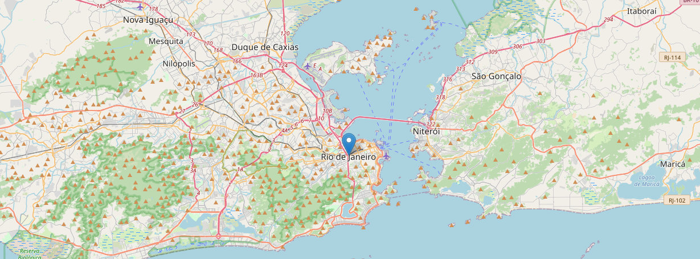

# Serviço de Geolocalização



Hoje em dia, muita das vezes recebemos diversas ligações de número telefônicos e não sabemos de onde vem, chega a ser chato, não é? Diante disso, pesquisando sobre geolocalização, resolvi aprimorar os conhecimentos adquiridos durante a aula de Python para Segurança do Bootcamp, onde o instrutor  demostrou uma ferramenta para realizar a verificação de um número telefônico. 

Para resolver esse problema , iremos utilizar as seguintes bibliotecas disponibilizadas para a linguagem python.

Nessa primeira parte,  caso não tenham elas instaladas irei disponibilizar os links da documentação de cada uma delas. 

- [Phone Numbers](https://pypi.org/project/phonenumbers/)

  - "Versão Python da biblioteca comum do Google para análise, formatação, armazenamento e validação de números de telefone internacionais."

- [Open Cage](https://opencagedata.com/tutorials/geocode-in-python)

  - "Uma API para converter coordenadas em lugares"

- [Folium](https://python-visualization.github.io/folium/quickstart.html)

  - "Manipule seus dados em Python e visualize-os em um mapa."

    

Depois de realizar a instalação,  vamos criar um arquivo .py e importar para o nosso programa.

```python
import phonenumbers

from phonenumbers import geocoder

from opencage.geocoder import OpenCageGeocode

import folium
```

 Agora, iremos inserir um numero de telefone no formato string, e em seguida será convertido para um objeto da biblioteca phonenumbers.

```python
num_phone = "+5556992344445"

phone = phonenumbers.parse(num_phone)
```

Depois de criar o número, vamos passar como parâmetro para a função abaixo, que vai retorna a região onde o número foi registrado. 

```python
geoloc = geocoder.description_for_number(phone, "pt")
```

O Comando abaixo irá imprimir a localização encontrada. 

```python
print(geoloc)
```

Agora iremos utilizar a biblioteca geocoder, para isso precisamos criar um registro no [site](https://opencagedata.com/), para obter uma chave. 

```python
key = 'insira_sua_chave_aqui'

geocoder = OpenCageGeocode(key)
```

Depois de obter a chave, vamos criar uma pesquisa com a localização retornada pelo pacote  phonenumbers. 

A Variável results retorna um estrutura de chave e valor, chamada de dicionário. Com isso conseguimos acessar a posição 0 da lista e obter através da chave geometry a latitude e longitude da nossa região. 

```python
query = geoloc

results = geocoder.geocode(query)

lat = results[0]['geometry']['lat']

lng = results[0]['geometry']['lng']
```

Agora basta criar o mapa, veja como é muito simples. 

```python
map_phone = folium.Map(location=[lat, lng], zoom_start=11)
```

Agora vamos realizar a marcação das coordenadas. 

```python
folium.Marker([lat,lng], popup=geoloc).add_to((map_phone))
```

e por fim, salvar a pagina no formato html. 

```python
map_phone.save("map_phone.html")
```


Lohan Amendola 

Data: Jul/2021
